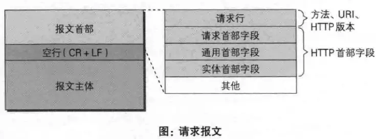

# HTTP

## HTTPS

https是利用ca认证的证书来加密的.

## URI和URL的区别

uri是资源的身份,而url是指向资源的路径.

uri包含这url,url是一种特殊的uri.

## http常见的方法

- get
- post
- put
- head,用于认证uri是否有效,只返回header,不返回body
- delete
- options,用于获取资源支持的方法

## 请求报文

## 响应报文

[https](HTTP/https.md)

## 常见状态码

- 200 正确处理
- 204 被处理但是没有资源
- 301 永久重定向
- 302 临时重定向
- 400 参数有无
- 401 需要认证
- 403 禁止访问
- 404 资源不存在
- 500 服务器错误
- 503 服务器繁忙

## 优化

- tcp复用,使用keepalive,让服务器可以复用tcp链接
- 缓存
- 压缩
- ssl加速

## http2特性

- 二进制分帧
    http2采用二进制传输数据,而不是http1.1的文本格式,http2将请求和响应数据分割为帧,传输数据效率更高.各个数据帧可以乱序,通过头部信息拼接.
- 多路复用
    http1.1中,并发请求一般要躲开多个tcp链接,但是每个域名一般会有6-8个限制.http2使用的二进制分帧后,一个域名可以使用一个tcp链接进行并发请求,性能更高.
- 服务器推送
    http1.1只允许客户端对服务端发起请求,http2服务端可以主动向客户端推送数据.
- 头部压缩
    http每次请求都会发送头部信息,携带cookie等数据,头部越来越大.http2使用一种专门的算法HPACK压缩头部信息,减少带宽占用

## http1.0 与 http2.0的区别

### 持久连接

http1.0,每一对Request/Response都会使用新的连接,需要通过手动设置:keepalive参数才能开启持久连接(长连接)
http1.1,支持持久连接,默认使用持久连接

### Host域

http1.1在请求头会多一个host字段:
Host: baidu.com

### 日期时间戳

(接收方向)
无论是HTTP1.0还是HTTP1.1，都要能解析下面三种date/time stamp：
Sun, 06 Nov 1994 08:49:37 GMT ; RFC 822, updated by RFC 1123
Sunday, 06-Nov-94 08:49:37 GMT ; RFC 850, obsoleted by RFC 1036
Sun Nov 6 08:49:37 1994 ; ANSI C's asctime() format
(发送方向)
HTTP1.0要求不能生成第三种asctime格式的date/time stamp；
HTTP1.1则要求只生成RFC 1123(第一种)格式的date/time stamp。

### 传送内容

http1.1支持只传输内容的一部分,利用Range和Content-Range头部信息

### 状态码

http1.1 增加了好多的状态码

## http与https挥手的区别

- http挥手是tcp挥手
- https挥手
  1. 客户端发起请求,发送: 随机数(client random), 客户端支持的加密方式
  2. 服务端回复加密方法,回复: 随机数(server, random),加密方式,整数,非对称加密的公钥.
  3. 客户端收到后,利用服务端的公钥+新随机数(premaster random),利用服务端回复的加密方式加密后发给服务端.
  4. 服务端收到回复后,利用加密方式进行揭秘,同时利用三个随机数通过一定的算法生成堆成加密key(session-key)