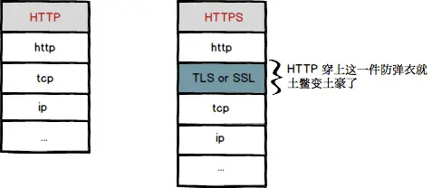

# https

https是加入了tls/ssl算法的http协议.http协议非常容易遭受到中间人攻击.

### 原理图

### 两种加密算法

- 对称加密

    加密解密使用同一个密匙.

    优点: 速度快

    缺点:安全性较低,密匙容泄漏

- 非对称加密(公开密匙加密)

    加密解密的密匙不同.公钥加密,私钥解密.

    优点: 安全

    缺点: 执行慢