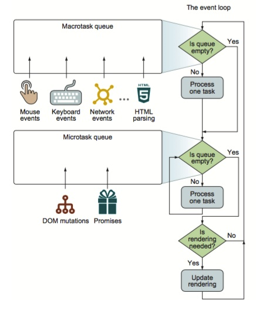

# Event

## Promise

`Promise` 中 `.then` 的第二个参数是只能接收到 `reject` 后的执行,而`.catch` 是接受抛出的错误.

## 宏任务和微任务(macroTask & microTask)

 基础机制如下图

如上图所示，在单次的迭代中，event loop首先检查macrotask队列，如果有一个macrotask等待执行，那么执行该任务。当该任务执行完毕后（或者macrotask队列为空），event loop继续执行microtask队列。如果microtask队列有等待执行的任务，那么event loop就一直取出任务执行知道microtask为空。这里我们注意到处理microtask和macrotask的不同之处：在单次循环中，**一次最多处理一个macrotask**（其他的仍然驻留在队列中），**然而却可以处理完所有的microtask**。

当microtask队列为空时，event loop检查是否需要执行UI重渲染，如果需要则重渲染UI。这样就结束了当次循环，继续从头开始检查macrotask队列。

**macro-task**: script (整体代码)，setTimeout, setInterval, setImmediate, I/O, UI rendering.

**micro-task**: process.nextTick, Promise(原生)，Object.observe，MutationObserver

除了script整体代码，micro-task的任务优先级高于macro-task的任务优先级。其中，script(整体代码) ，可以理解为待执行的所有代码。