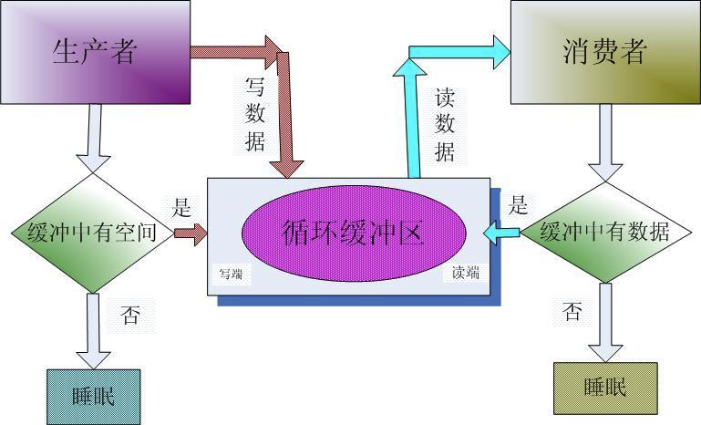

# IO

## buffer

buffer 是Nodejs用来处理二进制大小的类.类似于正数数组,其大小固定不变.

## Stream

在 Node.js 中有四种基本的流类型：Readable（可读流），Writable（可写流），Duplex（双向流），Transform（转换流）。

- 可读流是数据可以被消费的源的抽象。一个例子就是 fs.createReadStream 方法。
- 可读流是数据可以被写入目标的抽象。一个例子就是 fs.createWriteStream 方法。
- 双向流即是可读的也是可写的。一个例子是 TCP socket。
- 转换流是基于双向流的，可以在读或者写的时候被用来更改或者转换数据。一个例子是 zlib.createGzip 使用 gzip 算法压缩数据。你可以将转换流想象成一个函数，它的输入是可写流，输出是可读流。你或许也听过将转换流成为“通过流（through streams）

### 可读流和可写流的API

### 流的模式

流的模式一般有两种:

- 暂停模式(pull mode)
- 流转模式(push mode)