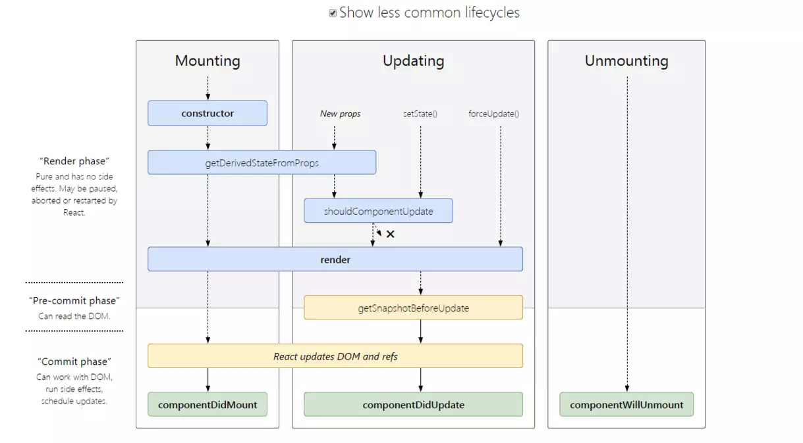

# Rect

## 受控组件

受控组件一般是表单组件

受控组件 | 非受控组件
1. 没有维持自己的状态 | 1. 保持着自己的状态
2.数据由父组件控制 | 2.数据由 DOM 控制
3. 通过 props 获取当前值，然后通过回调通知更改 | 3. Refs 用于获取其当前值

## 生命周期

### 挂载阶段:

- construct
- getDerivedStateFromProps
- render
- componentDidMount

### 更新阶段

- getDerivedStateFromProps
- shouldComponentUpdate
- render
- componentDidUpdate

### 卸载阶段

- componentWillUnmount

## setState是同步还是异步

有时候同步,有时候“异步”.只是在合成事件和钩子函数中是“异步”的.因为合成事件和钩子函数调用顺序在更新之前.

## 组件通讯

- 父向子,通过`props`
- 子向父,父通过`props`传一个函数给子调用
- 兄弟通讯,通过相同的父组件
- 跨层级,通过`context`
- `redux`和`Mobx`

[Component reuse solution](Rect/Component%20reuse%20solution.md)

## Fiber

React 16之前使用的是`recocilation`算法,是一种递归算法,想要中断递归更新是很困难的,而`Fiber`是一种循环算法.

`Fiber`：一种将 `recocilation` （递归 diff），拆分成无数个小任务的算法；它随时能够停止，恢复。停止恢复的时机取决于当前的一帧（16ms）内，还有没有足够的时间允许计算。

## Time Slice

异步渲染模式.把渲染任务分开,一次渲染一点,不阻塞当前线程.如果性能差的机器,渲染会有延迟,但是不会卡顿.

## Subspence

- 引入新的api: `this.deferSetState`可以使任何state更新暂停,等满足条件再更新.
- 可以设置区分网络快和慢的行为
- 有高级API和底层一点的api.

## Redux

- store,保存state的地方
- state,数据对象
- action,更改state的动作
- reducer,action更改state时触发的操作,接受action和state作为参数,返回新的state
- dispatch,view层面触发action的函数

### 与mobx的区别

- redux是单一store,mobx存在多个store
- redux使用plain object保存state,而mobx使用Objervable保存数据
- redux的状态是immutable,只能返回一个新的状态
- mobx比较简单,使用面对对象思想,redux是函数式编程思想

### 异步流中间件

1. redux-thunk

    **优点:** 体积小,使用简单.

    **缺点:** 样板代码多,耦合严重(异步操作和action耦合),功能少

2. redux-saga

    **优点:** 功能强大,灵活,容易测试,异常处理

    **缺点:** 学习成本高,对ts支持不好,功能太多,体积大

3. redux-observable

    **优点:**背靠rxjs,功能强大

    **缺点:**学习成本太高