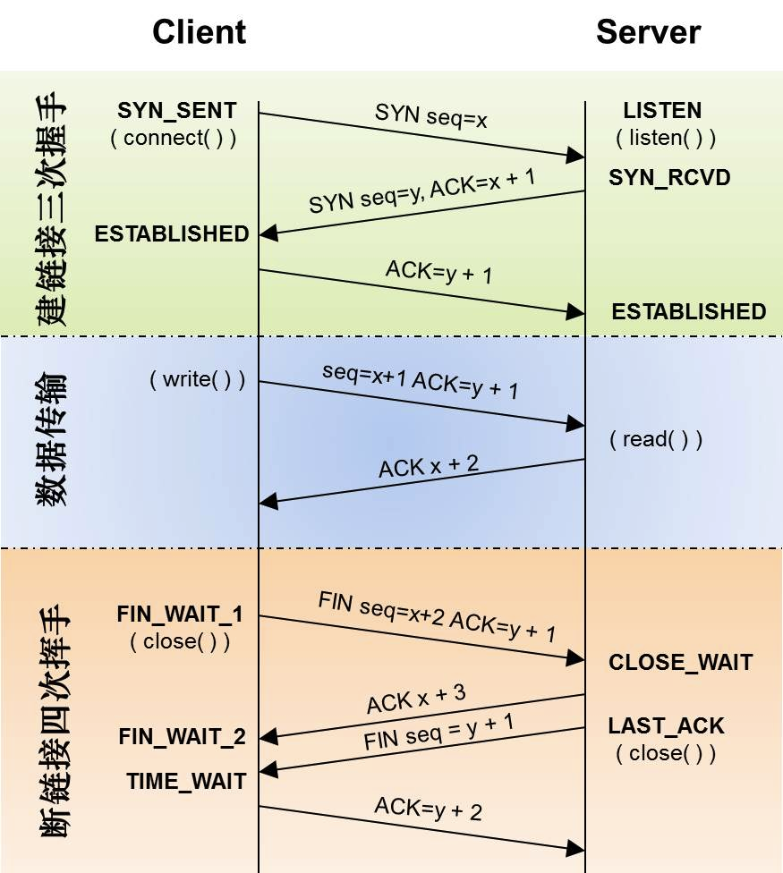

# TCP

## OSI七层模型

1. 物理层, physical layer

    在局部局域网中传输数据帧(data frame),管理通信设备于网络的互通,包括针脚,中继器,网卡,主机接口等.

2. 数据链路层, data link layer 

    负责网络寻址、错误侦测和改错.例如以太网、无线局域网、GPRS

3. 网络层, network layer(IP协议)

    决定数据的路径选择和转寄.

4. 传输层,transport layer (TCP协议)

    把传输表头加至数据以形成数据包.

5. 会话层, session layer

    扶着建立两台电脑之间的链接.

6. 表达层, presentation layer

    把数据转换为接受者格式兼容的格式

7. 应用层, application layer (HTTP协议)

    为应用软件而设置的接口.

## TCP头

- sequence number 包序列号,用来解决网络包乱序
- acknowledge number确认码,用来解决丢包问题
- window滑动窗口,解决流控
- TCP flag 包类型,操控TCP状态机

## TCP状态机

## TCP粘包

默认状态下,TCP算法会采用延迟算法(Nagle算法),在多个数据一起发送的时候,缓冲到一起发送.

粘包可能有几个可能

- A. 先接收到 data1, 然后接收到 data2 .
- B. 先接收到 data1 的部分数据, 然后接收到 data1 余下的部分以及 data2 的全部.
- C. 先接收到了 data1 的全部数据和 data2 的部分数据, 然后接收到了 data2 的余下的数据.
- D. 一次性接收到了 data1 和 data2 的全部数据.

解决方案有:

1. 每次发送等待一个间隔时间
2. 关闭延迟算法
3. 进行封包拆包

## 超时重传

服务端一直内收到客户端的某个ack,超时后会进行重传,一般有两种策略:

- 仅重传超时的包,节省带宽,慢
- 重传超时的和之后的包,浪费带宽,快

## 快速重传 fast retransmit

三次收到相同ack(客户端缺少的包)就重传丢失的包.

## SACK方法 selective acknowledge

在TCP头加入一个sack,客户端把收到的数据数版发送给服务端,服务端就可以知道缺少的包.

缺点是会消耗发送端的资源.

## duplicate SACK 重复收到数据

利用这个标志表明接收端收到重复的数据,优点在于:

1）可以让发送方知道，是发出去的包丢了，还是回来的ACK包丢了。

2）是不是自己的timeout太小了，导致重传。

3）网络上出现了先发的包后到的情况（又称reordering）

4）网络上是不是把我的数据包给复制了。

## TCP滑动窗口

TCP主要解决的问题是可靠传输和包乱序问题.

发送端接受数据示意图:

## zero window

滑动接收方太忙的时候会导致窗口越来越小的情况,甚至到0.这时候发送放就会发送ZWP包给接收方,如果三次都还是0,那么发送方就会短掉链接.

## TCP拥塞处理 - congestion handling

主要是以下四个算法:

1. 慢启动

    刚开始的时候慢慢加速,指数上升,直到到达阈值.

2. 拥塞避免

    慢启动加速到一个阈值的时候,就会进入这个算法,这个算法是慢慢线性上升的算法.

3. 拥塞发生

    RTO超时后,慢启动阈值就会降低到一半,然后流量又再次上涨的阈值,再慢慢提高阈值.

4. 快速恢复
    - cwnd = sshthresh + 3 * MSS （3的意思是确认有3个数据包被收到了）
    - 重传Duplicated ACKs指定的数据包
    - 如果再收到 duplicated Acks，那么cwnd = cwnd +1
    - 如果收到了新的Ack，那么，cwnd = sshthresh ，然后就进入了拥塞避免的算法了。

[TCP 的那些事儿（上） | | 酷 壳 - CoolShell](https://coolshell.cn/articles/11564.html)

## TIME_WAIT

`TIME_WAIT` 是连接的某一方 (可能是服务端也可能是客户端) 主动断开连接时, 四次挥手等待被断开的一方是否收到最后一次挥手 (ACK) 的状态. 如果在等待时间中, 再次收到第三次挥手 (FIN) 表示对方没收到最后一次挥手, 这时要再 ACK 一次. 这个等待的作用是避免出现连接混用的情况 (`prevent potential overlap with new connections` see **[TCP Connection Termination](http://www.tcpipguide.com/free/t_TCPConnectionTermination.htm)** for more).

出现大量的 `TIME_WAIT` 比较常见的情况是, 并发量大, 服务器在短时间断开了大量连接. 对应 HTTP server 的情况可能是没开启 `keepAlive`. 如果有开 `keepAlive`, 一般是等待客户端自己主动断开, 那么`TIME_WAIT` 就只存在客户端, 而服务端则是 `CLOSE_WAIT` 的状态, 如果服务端出现大量 `CLOSE_WAIT`, 意味着当前服务端建立的连接大面积的被断开, 可能是目标服务集群重启之类.