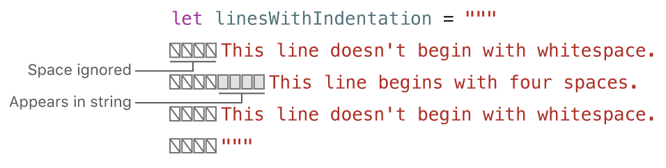

# 字符与字符串

# 多行换行符

多行字符串跟python一样,使用三个双引号开始 """ ,多行字符里面的双引号会自动转义.结尾使用 反斜杠 \ 来手动换行.
```swift
    let quotation = """
    The White Rabbit put on his spectacles.  "Where shall I begin,
    please your Majesty?" he asked.
    
    "Begin at the beginning," the King said gravely, "and go on
    till you come to the end; then stop."
    """
```

多行换行符的缩进以第一行的开头为准,例如:



使用 \u{char} 表示Unicode

字符串是可变类型,可以直接在原字符串中插入,删除,变更.